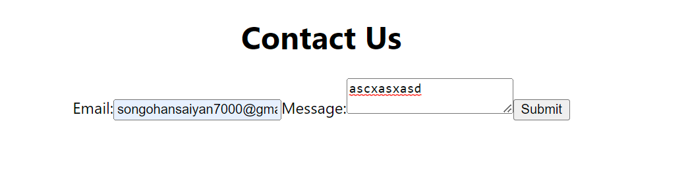
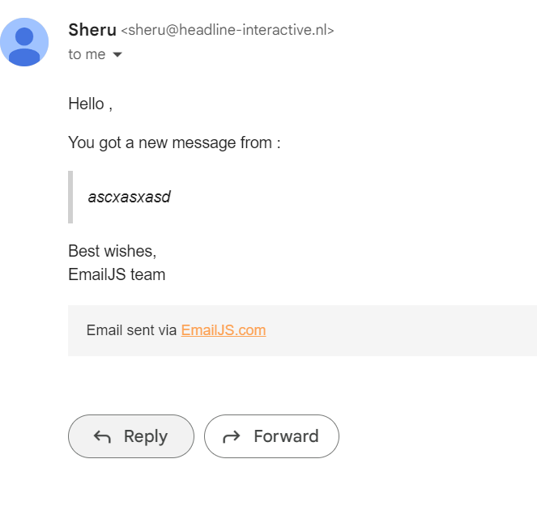

> ## **08/03/2023**
> # **Testing Email Api**
- ## **Test Type:** Manual
- ## **Results:** Succesful
- ## **Details:** Test was done by sending an email to my personal email address using the emailJS API. The email was sent succesfully and the content was correct.
- ## **Conclusion:** The API works as intended and can be used for sending emails from the website.
- ## **Proof:** 
 # **Input:** 

       
# **Output:**

       
Backendpreviews can be found in current direcotry